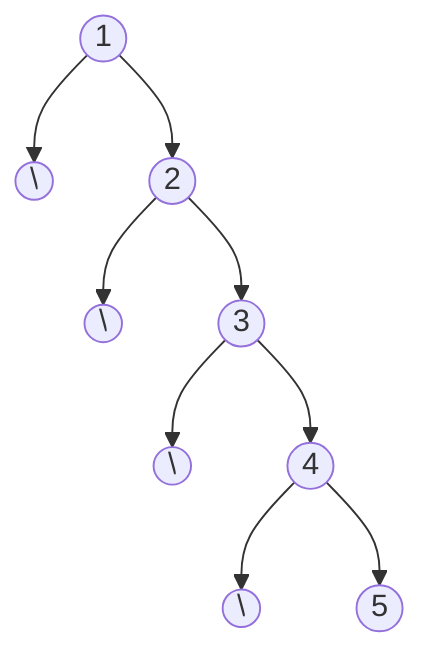
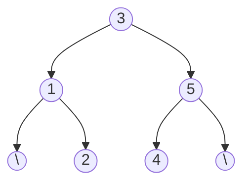
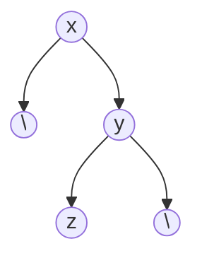
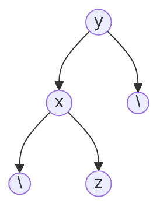
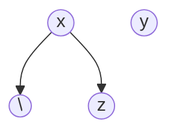

# Abstract

The purpose of this project is dually focused on carrying out a study in C++ and implementing a Binary Search Tree. If time allows, Red-Black balancing will be attempted.

# Research

## 25 September 2025

It's been a long time since I've used C++. In fact, I believe the last time I was really involved with it was when C++14 was new and shiny. That being said, I'm very rusty on pointers and dereferencing. In recent years, I've been much more exposed to C#, Java, JavaScript, and, of course, Python. I set out to remember syntax, conventions, and most importantly, to understand pointers.

I first looked to [LearnC++](https://learncpp.com), which was a very good refresher. I was soon reminded of foregone syntactic knowledge.

One major question I had was why I was seeing examples of node-based data structures use pointers. After looking through the aforementioned site and a few others, and an [enlightening discussion with ChatGPT](https://chatgpt.com/share/68d45939-56c4-800a-934b-59f726bb2d5d), I arrived at an answer, which is one that should have been much more obvious had I given thought to it; because nodes often store a *reference* to their parent, child, siblings (etc.), it is necessary for that reference to be a pointer. If this were not the case, we would see a Node object holding a Node object, which would be holding a Node object, which would be holding yet another Node object and so on. Naturally, this recursive structure extends into infinity. Instead, we tell the program using pointers that we are going to *dynamically allocate* the references to relative nodes, which are only created once we know that they *should*.

## 26 September 2025

Having now taken a fair amount of time researching Binary Search Trees, I believe that this is a very reasonable task. The concept is simple enough; we build a tree by adding nodes to the left or right of existing nodes. The tree itself will have a reference to a single root node, which holds references to its own left and right nodes, and so on. When adding data to the tree, if the value is less than the current node, we traverse the tree to the left. Likewise, if the value should be greater than that of the current node, we traverse to the right. Once we've found a null node, we create a new node and attach it to the tree.

Given that we have a well-maintained, balanced tree, when it comes time to search for values within the data set, we are able to find the data extremely quickly, as with each iteration we remove roughly half of all possible nodes to search.

# Implementation

## 27 September 2025

I've now implemented the basics of the BST. The current functionality allows for insertion (via `insert()`) and printing the list (via `inOrder()`). Also, upon destruction of the BST, all nodes are safely and recursively deleted from the tree to free up all memory.

The biggest hangup that I had was properly implementing `insert()`. Traversing the tree and finding the insertion point proved to be extremely straightforward and simple, and I had achieved it in very little time. I confirmed this with several differing tests. To my shock, however, when I attempted to print out the list, it appeared to be empty! From previous experimenting I knew that `inOrder()` was functioning as intended, so I could easily infer that the mistake was to be found somewhere within `insert()`. It took an embarrassingly long time to realize that I was creating the new node but never attaching it to the tree! So here I was creating, in effect, endless nodes floating aimlessly in the void with no means by which to access them for later use. This was a quick and simple fix, and once it was implemented my lists were printing beautifully sorted!

It is important to note that at this point, the tree is yet to have the capability to balance itself, so entering `1, 2, 3, 4, 5` in that order will result in a horrendously lopsided right-side-heavy tree, completely tainting the deliciously sought after efficiency of O(log *n*):



Ideally, we would like for the tree to be balanced:



With this visualization, it is much easier to understand on a small scale how we are eliminating a large portion of nodes with each iteration: if we were to search for 4, for example, we would start at the root node. Seeing as 4 is greater than 3, we traverse to the right. Because we know that no value greater than 3 can ever be placed to the left, we can skip all leftward nodes. We then move to the node containing 5, where the process is repeated, only traversing to the left this time. There aren't any valid nodes to the right, but were we to have any, we again wouldn't have to check any of them. In this case, instead of making four checks (as we would have to in a sorted array), we only make two before finding our value.

## 29 September 2025

The next step we need to take is implementing functionality to rotate nodes. After some research, I settled on a solution. We need to go from this:



To this:



The solution I came to:

```c++
void BST::rotateLeft(Node* x) {
   // Point at y since we're about to replace its spot and therefore would lose reference to it otherwise
   Node* y = x->right;

   // Set y->left to its new position
   x->right = y->left;
   if (x->right) {
      x->right->parent = x;
   }

   // Set the new parent of y
   y->parent = x->parent;
   if (x == root) {
      root = y;
   }
   else if (x == x->parent->left) {
      x->parent->left = y;
   }
   else {
      x->parent->right = y;
   }

   // Reestablish the relationship between x and y
   y->left = x;
   x->parent = y;
}
```

Which, on the above tree step-by-step, looks like this:


1. Point y to the right node of x and then set y->left to be x->right (if it is not null, set its parent to be x):



2. Set the parent of y to be the new parent of x. If it is now null, that means it's the root. Otherwise, set x to be the proper (left or right) child of its parent.

3. Set the relationship between x and y:


We can then do this same thing but reversed for a right-side rotation.

## 2 October 2025

This was a big day. The main goal I had when sitting down at the project was to color nodes upon insertion. Of course, it is simple to follow the first steps of coloring nodes; The basics are that any null nodes are black, any new nodes are red, and the root node is always black. The major challenge is making sure that *all* properties are satisfied:

1. All nodes are either red or black
2. The root of the tree is *always* black
3. All leaves (or `null` nodes) are black
4. Red nodes cannot be adjacent (no red node can have a red child)
5. Every path from a node to its leaves must have the same number of black children

Naturally, not only is it the case that the last property is the most difficult to satisfy, but also it is the most difficult to *understand*. It took me quite a while to conceptualize what it was talking about, and no one source that I could find gave a sufficiently descriptive explanation, but rather, my understanding of the rule is an amalgamation from different sites.

The concept is not too difficult to understand; essentially what we are saying is that if you traverse from any node in the tree to any of its leaves, you should always visit the same amount of black nodes, regardless of which leaf you chose. My struggle stemmed from attempting to conceptualize how to even begin making sure that this could be achieved without cyclically changing node colors and rotations.

I found a very useful page [here](https://www.geeksforgeeks.org/dsa/insertion-in-red-black-tree/), which outlined the steps to take to make sure that property number five was kept satisfied. 

Now that this has been implemented, the next step is to implement deletion, seeing as the only way to interact with the tree right now is to permanently insert data.
